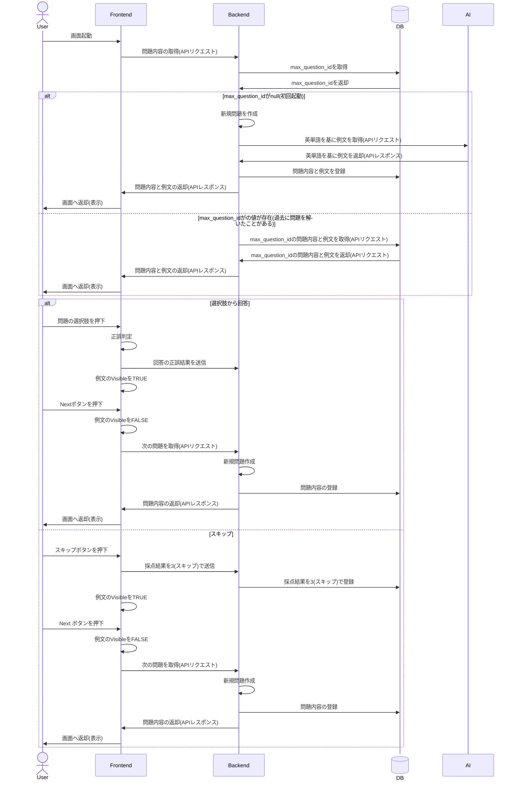

```mermaid
sequenceDiagram

actor User
User ->> Frontend : 画面起動
Frontend ->> Backend : 問題内容の取得(APIリクエスト)
participant DB@{ "type" : "database" }
Backend ->> DB : max_question_idを取得
DB ->> Backend : max_question_idを返却

alt max_question_idがnull(初回起動)
    Backend ->> Backend : 新規問題を作成
    Backend ->> AI : 英単語を基に例文を取得(APIリクエスト)
    AI ->> Backend : 英単語を基に例文を返却(APIレスポンス)
    Backend ->> DB : 問題内容と例文を登録
    Backend ->> Frontend : 問題内容と例文の返却(APIレスポンス)
    Frontend ->> User : 画面へ返却(表示)

else max_question_idがの値が存在(過去に問題を解いたことがある)
    Backend ->> DB : max_question_idの問題内容と例文を取得(APIリクエスト)
    DB ->> Backend : max_question_idの問題内容と例文を返却(APIリクエスト)
    Backend ->> Frontend : 問題内容と例文の返却(APIレスポンス)
    Frontend ->> User : 画面へ返却(表示)
end


alt 選択肢から回答
    User ->> Frontend : 問題の選択肢を押下
    Frontend ->> Frontend : 正誤判定
    Frontend ->> Backend : 回答の正誤結果を送信
    Frontend ->> Frontend : 例文のVisibleをTRUE

    User ->> Frontend : Nextボタンを押下
    Frontend ->> Frontend : 例文のVisibleをFALSE
    Frontend ->> Backend : 次の問題を取得(APIリクエスト)
    Backend ->> Backend : 新規問題作成
    Backend ->> DB : 問題内容の登録
    Backend ->> Frontend : 問題内容の返却(APIレスポンス)
    Frontend ->> User : 画面へ返却(表示)

else スキップ
    User ->> Frontend : スキップボタンを押下
    Frontend ->> Backend : 採点結果を3(スキップ)で送信
    Backend ->> DB : 採点結果を3(スキップ)で登録
    Frontend ->> Frontend : 例文のVisibleをTRUE

    User ->> Frontend : Next ボタンを押下
    Frontend ->> Frontend : 例文のVisibleをFALSE
    Frontend ->> Backend : 次の問題を取得(APIリクエスト)
    Backend ->> Backend : 新規問題作成
    Backend ->> DB : 問題内容の登録
    Backend ->> Frontend : 問題内容の返却(APIレスポンス)
    Frontend ->> User : 画面へ返却(表示)

end

```