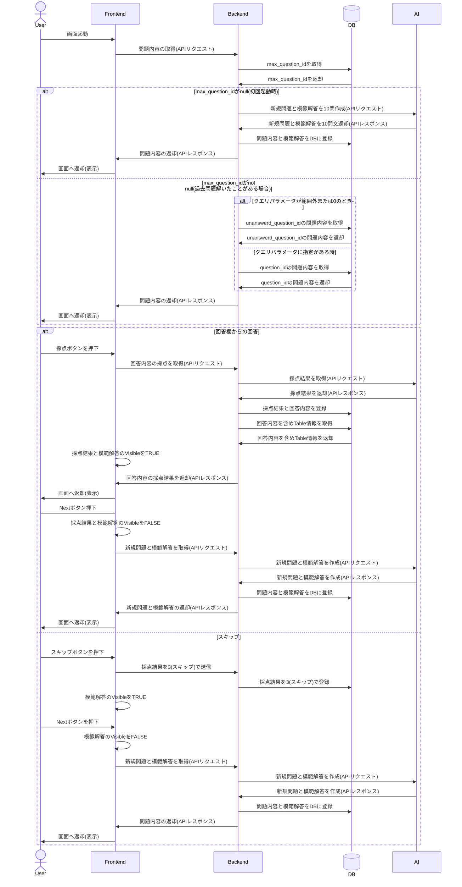

```mermaid
sequenceDiagram
    actor User
    User ->> Frontend : 画面起動
    Frontend ->> Backend : 問題内容の取得(APIリクエスト)
    participant DB@{ "type" : "database" }
    Backend ->> DB : max_question_idを取得
    DB ->> Backend : max_question_idを返却

    alt max_question_idがnull(初回起動時)
        Backend ->> AI : 新規問題と模範解答を10問作成(APIリクエスト)
        AI ->> Backend : 新規問題と模範解答を10問文返却(APIレスポンス)
        Backend ->> DB : 問題内容と模範解答をDBに登録
        Backend ->> Frontend : 問題内容の返却(APIレスポンス)
        Frontend ->> User : 画面へ返却(表示)

    else max_question_idがnot null(過去問題解いたことがある場合)
        alt クエリパラメータが範囲外または0のとき
            Backend ->> DB : unanswerd_question_idの問題内容を取得
            DB ->> Backend : unanswerd_question_idの問題内容を返却

        else クエリパラメータに指定がある時
            Backend ->> DB : question_idの問題内容を取得
            DB ->> Backend : question_idの問題内容を返却

        end
            Backend ->> Frontend : 問題内容の返却(APIレスポンス)
            Frontend ->> User : 画面へ返却(表示)
    end

    alt 回答欄からの回答
        User ->> Frontend : 採点ボタンを押下
        Frontend ->> Backend : 回答内容の採点を取得(APIリクエスト)
        Backend ->> AI : 採点結果を取得(APIリクエスト)
        AI ->> Backend : 採点結果を返却(APIレスポンス)
        
        Backend ->> DB : 採点結果と回答内容を登録
        Backend ->> DB : 回答内容を含めTable情報を取得
        DB ->> Backend : 回答内容を含めTable情報を返却

        Frontend ->> Frontend : 採点結果と模範解答のVisibleをTRUE

        Backend ->> Frontend : 回答内容の採点結果を返却(APIレスポンス)
        Frontend ->> User : 画面へ返却(表示)

        User -> Frontend : Nextボタン押下
        Frontend ->> Frontend : 採点結果と模範解答のVisibleをFALSE
        
        Frontend ->> Backend : 新規問題と模範解答を取得(APIリクエスト)
        Backend ->> AI : 新規問題と模範解答を作成(APIリクエスト)
        AI ->> Backend : 新規問題と模範解答を作成(APIレスポンス)
        Backend ->> DB : 問題内容と模範解答をDBに登録
        Backend ->> Frontend : 新規問題と模範解答の返却(APIレスポンス)
        Frontend ->> User : 画面へ返却(表示)

    else スキップ
        User ->> Frontend : スキップボタンを押下
        Frontend ->> Backend : 採点結果を3(スキップ)で送信
        Backend ->> DB : 採点結果を3(スキップ)で登録
        Frontend ->> Frontend : 模範解答のVisibleをTRUE

        User ->> Frontend : Nextボタンを押下
        Frontend ->> Frontend : 模範解答のVisibleをFALSE

        Frontend ->> Backend : 新規問題と模範解答を取得(APIリクエスト)
        Backend ->> AI : 新規問題と模範解答を作成(APIリクエスト)
        AI ->> Backend : 新規問題と模範解答を作成(APIレスポンス)
        Backend ->> DB : 問題内容と模範解答をDBに登録

        Backend ->> Frontend : 問題内容の返却(APIレスポンス)
        Frontend ->> User : 画面へ返却(表示)
    end
```